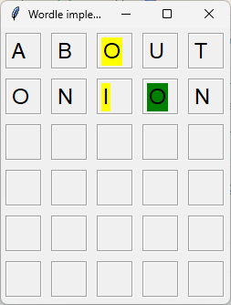
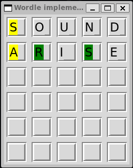

# WORDLE
The popular word guessing game implemented in Python Tkinter


## Screenshots

| Windows | Linux |
|---|---|
|  |  |

## Table of Contents
- [About](#about)
- [Features](#features)
- [Installation](#installation)
- [Usage](#usage)
- [Limitation & Future Improvement](#limitation--future-improvement)

## About
Wordle took internet by storm as a popular word guessing game couple of years ago. If by any chance you haven't fallen in this
storm, here is quick guide about what the game is (though the game is very intuitive) - 
<ul>
  <li>There is a secret 5 letter english word (case insensitive)</li>
  <li>You are given 6 chance to guess that word</li>
  <li>You type a word and press ENTER</li>
  <li>If the word is not valid, your entry will be cleared and you will be given another chance to put valid word</li>
  <li> If it is valid, but not exactly the hidden word, then visual cue will be displayed -</li>
    <ul>
      <li>If a character in your word is in correct position as in the hidden word it will be - GREEN</li>
      <li>If a character in your word is in the hidden word but in wrong position it will be - YELLOW</li>
      <li>If a character is not present in the hidden word - As is it</li>
    </ul>
  <li>Using these visual cues you can narrow your guess and find out the hidden word within 6 attempts.</li>
  <li>Otherwise, after six abortive attempts, a pop up will show the hidden word.</li>
</ul>

## Features
- Runs in Windows, Linux and macOS

## Installation
```bash
No external dependencies required.

> **Linux users:** If Tkinter is not available, install it via:
sudo apt install python3-tk


git clone https://github.com/sabb1r/wordle.git
cd wordle
pip install -r requirements.txt
```

## Usage
```bash
# Start Game
python game.py
```

## Limitation & Future Improvement
<ul>
  <li>No keyboard display</li>
  <li>No visual representation of game status</li>
  <li>No history of game records</li>
  <li>Only letters are highlighted instead of whole block</li>
  <li>No animation when the hidden word is correctly guessed by the player</li>
</ul>
